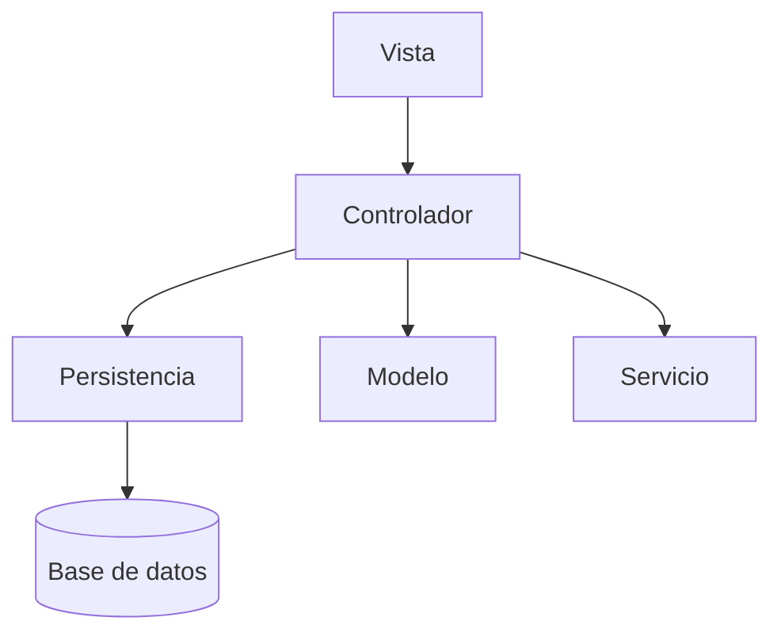

# AppChat


- Autoría: [María Ballester Martínez](https://github.com/mariaballesteer), e [Ibrahim Cherif Barry](https://github.com/ibracb).

- Proyecto académico de la asignatura Tecnologías de Desarrollo de Software, Grado de Ingeniería Informática, Universidad de Murcia. Curso 2024/2025.
- Sistema de chat de escritorio (Java Swing) inspirado en aplicaciones populares como WhatsApp: usuarios, contactos individuales, grupos, chat de mensajería, búsqueda con filtros, exportación de chats a PDF y una suscripción Premium con descuentos.

## Arquitectura (resumen)

AppChat sigue una arquitectura en capas basada en el principio de separación Modelo-Vista-Controlador (MVC): la Vista delega en el Controlador, y este coordina la Persistencia, el Modelo y los Servicios.



Más detalle, incluyendo la estructura de paquetes, en [`docs/arquitectura.md`](docs/arquitectura.md).

## Requisitos previos

- **Java 21+** — verificar con `java --version`
- **Maven 3+** — verificar con `mvn --version`

## Instalación de dependencias

Hay que instalar dos librerías en el repositorio local de Maven antes de compilar. Ejecute los siguientes comandos desde la raíz del proyecto:

```bash
mvn install:install-file -Dfile=lib/chatWindowLib.jar -DgroupId=tds -DartifactId=chat-window -Dversion="1.0.0" -Dpackaging=jar -DgeneratePom=true
```

```bash
mvn install:install-file -Dfile=lib/DriverPersistencia.jar -DpomFile=lib/driverPersistencia-2.0.pom
```

## Iniciar el servidor de persistencia

AppChat necesita un servidor de persistencia RMI para la base de datos. En otra terminal, ejecute:

```bash
java -jar ServidorPersistenciaH2.jar
```

El servidor se queda ejecutándose en primer plano. Déjelo abierto mientras usa la aplicación.

## Ejecución

La aplicación necesita **dos terminales abiertas a la vez**:

1. **Terminal 1** — el servidor de persistencia (sección anterior), que debe quedar corriendo.
2. **Terminal 2** — la aplicación:

```bash
mvn compile exec:java -Dexec.mainClass="umu.tds.apps.app.AppChat"
```

## Usuarios de prueba

Al arrancar, la aplicación carga una serie de usuarios, contactos, grupos y mensajes de ejemplo:

|Nombre|Teléfono|Contraseña|
|------|--------|----------|
|maria bm|212121212|m|
|ibra cb|313131313|i|
|maria bm2|121212121|m|
|ibra cb2|131313131|i|
|laura cc|171717171|l|
|maria jose tr|999999999|mj|
|alex ll|777777777|a|
|jorge sr|666666666|j|

## Documentación

Este README cubre la instalación y ejecución. Para la documentación técnica completa, consulta `docs/`:

- [`docs/arquitectura.md`](docs/arquitectura.md) — arquitectura en capas y estructura de paquetes
- [`docs/diagrama-clases.md`](docs/diagrama-clases.md) — diagrama de clases del modelo
- [`docs/diagrama-secuencia.md`](docs/diagrama-secuencia.md) — diagrama de secuencia (flujo añadir contacto a grupo)
- [`docs/patrones-diseno.md`](docs/patrones-diseno.md) — patrones de diseño utilizados
- [`docs/historias-de-usuario.md`](docs/historias-de-usuario.md) — historias de usuario y criterios de aceptación
