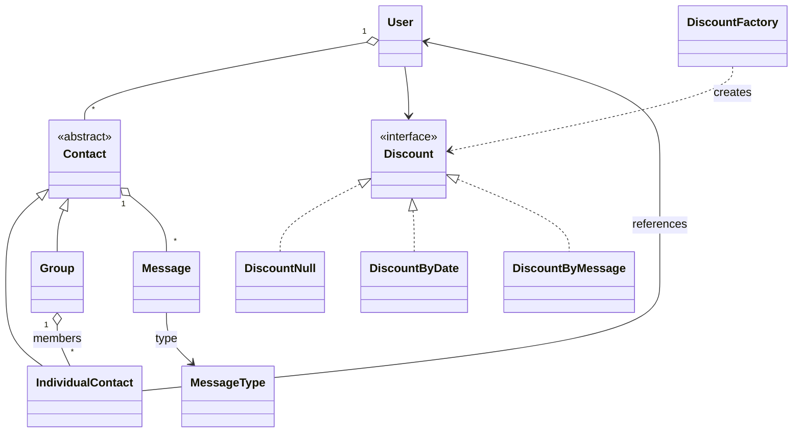

# Class diagram of the model

## System modelling

## Notes about the modelling

- `Contact` is an abstract class and the common root of `IndividualContact` and `Group`.
- An `IndividualContact` references the real AppChat `User` it represents.
- `Group` keeps its own collection of `IndividualContact` members, independent of the contacts of the user who created the group.
- A `User`'s discount is chosen by `DiscountFactory` (Strategy + Factory pattern), see [design-patterns.md](05-design-patterns.md).