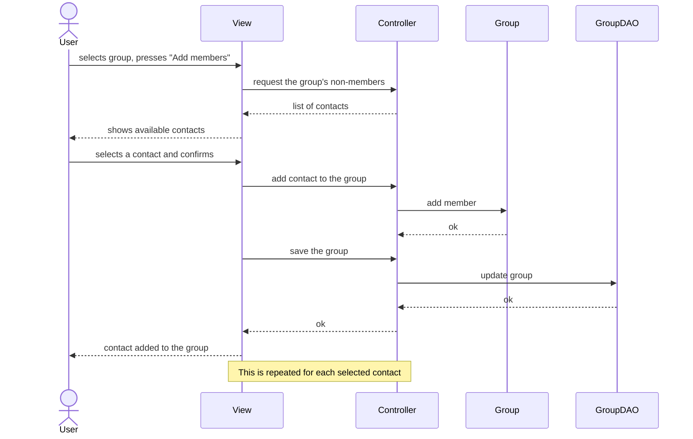

# Sequence diagram: adding a contact to a group

This diagram exemplifies the MVC pattern followed by AppChat: the View never accesses the Model directly; all requests pass through the Controller (Facade), which coordinates the Model and the Persistence.

