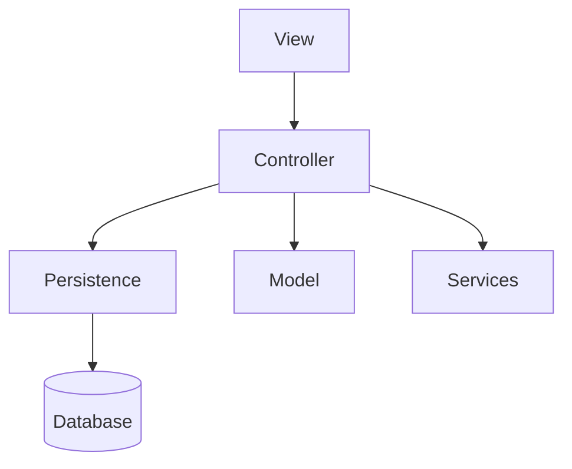

# Architecture

AppChat follows a **layered architecture** based on the principle of **Model–View separation**, applying the **Model–View–Controller (MVC)** architectural pattern.

The **View** receives the user's requests and communicates them to the **Controller**. The Controller delegates each request to the appropriate layer: to the **Persistence** layer if it involves saving, modifying, deleting or retrieving entities from the database; to the **Model** if it involves handling model entities in memory; or to a specific **Service** (for example, the PDF generator).

This design respects the fundamental principles of MVC: separation of responsibilities, loose coupling between layers, and a unidirectional data flow (the View never accesses the Model directly).

## Package structure

| Package | Responsibility |
|---|---|
| [`umu.tds.apps.app`](../src/main/java/umu/tds/apps/app) | Entry point ([`AppChat`](../src/main/java/umu/tds/apps/app/AppChat.java)) and loading of example data ([`DataLoader`](../src/main/java/umu/tds/apps/app/DataLoader.java)) |
| [`umu.tds.apps.controlador`](../src/main/java/umu/tds/apps/controlador) | The [`Controlador`](../src/main/java/umu/tds/apps/controlador/Controlador.java), the single point of coordination for the application logic |
| [`umu.tds.apps.modelo`](../src/main/java/umu/tds/apps/modelo) | Model entities: [`Usuario`](../src/main/java/umu/tds/apps/modelo/Usuario.java), [`Contacto`](../src/main/java/umu/tds/apps/modelo/Contacto.java), [`ContactoIndividual`](../src/main/java/umu/tds/apps/modelo/ContactoIndividual.java), [`Grupo`](../src/main/java/umu/tds/apps/modelo/Grupo.java), [`Mensaje`](../src/main/java/umu/tds/apps/modelo/Mensaje.java) |
| [`umu.tds.apps.modelo.descuentos`](../src/main/java/umu/tds/apps/modelo/descuentos) | Discount policies applied to the Premium subscription |
| [`umu.tds.apps.persistencia`](../src/main/java/umu/tds/apps/persistencia) | DAO interfaces |
| [`umu.tds.apps.persistencia.tdsimpl`](../src/main/java/umu/tds/apps/persistencia/tdsimpl) | DAO implementations using the TDS persistence service |
| [`umu.tds.apps.repositorios`](../src/main/java/umu/tds/apps/repositorios) | [`RepositorioUsuarios`](../src/main/java/umu/tds/apps/repositorios/RepositorioUsuarios.java), an in-memory cache of loaded users |
| [`umu.tds.apps.servicios`](../src/main/java/umu/tds/apps/servicios) | External services to which the Controller delegates (e.g. [`ExportPDF`](../src/main/java/umu/tds/apps/servicios/ExportPDF.java)) |
| [`umu.tds.apps.servicios.descargas`](../src/main/java/umu/tds/apps/servicios/descargas) | Resolution of the downloads folder according to the operating system |
| [`umu.tds.apps.servicios.filtros`](../src/main/java/umu/tds/apps/servicios/filtros) | Message filtering logic (search) |
| [`umu.tds.apps.utils`](../src/main/java/umu/tds/apps/utils) | Common constants and utilities |
| [`umu.tds.apps.vista`](../src/main/java/umu/tds/apps/vista) | Swing windows (frontend) |