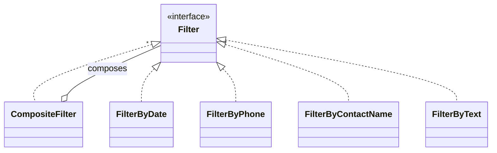

# Design patterns

## Used directly

### Composite — message filters
[`FiltroCompuesto`](../src/main/java/umu/tds/apps/servicios/filtros/FiltroCompuesto.java) dynamically accumulates several base filters ([`FiltroPorFecha`](../src/main/java/umu/tds/apps/servicios/filtros/FiltroPorFecha.java), [`FiltroPorMovil`](../src/main/java/umu/tds/apps/servicios/filtros/FiltroPorMovil.java), [`FiltroPorNombreContacto`](../src/main/java/umu/tds/apps/servicios/filtros/FiltroPorNombreContacto.java), [`FiltroPorTexto`](../src/main/java/umu/tds/apps/servicios/filtros/FiltroPorTexto.java)) and applies them all at once, treating the composite in the same way as any individual filter.

### Strategy — discount policy
A family of interchangeable discount algorithms ([`DescuentoPorFecha`](../src/main/java/umu/tds/apps/modelo/descuentos/DescuentoPorFecha.java), [`DescuentoPorMensaje`](../src/main/java/umu/tds/apps/modelo/descuentos/DescuentoPorMensaje.java), [`DescuentoNull`](../src/main/java/umu/tds/apps/modelo/descuentos/DescuentoNull.java)) behind the [`Descuento`](../src/main/java/umu/tds/apps/modelo/descuentos/Descuento.java) interface. Depending on the conditions of the [`Usuario`](../src/main/java/umu/tds/apps/modelo/Usuario.java), a single policy is chosen. It is accompanied by a Factory ([`FactoriaDescuentos`](../src/main/java/umu/tds/apps/modelo/descuentos/FactoriaDescuentos.java), an enum-singleton) that iterates over the available strategies and returns the first applicable one, or `DescuentoNull` if none apply. See [class-diagram.md](02-class-diagram.md).

### Factory Method — downloads folder per operating system
The PDF export service needs the system's Downloads folder, which differs by OS. [`FactoriaProveedorRutaDescargas`](../src/main/java/umu/tds/apps/servicios/descargas/FactoriaProveedorRutaDescargas.java) (an enum-singleton) delegates to the [`ProveedorRutaDescargas`](../src/main/java/umu/tds/apps/servicios/descargas/ProveedorRutaDescargas.java) (Linux/Windows/Mac) compatible with the runtime environment.

### Facade — the Controller
Given the layered architecture, the [`Controlador`](../src/main/java/umu/tds/apps/controlador/Controlador.java) acts as the single intermediary between the View and the Model: the View only knows the Controller, never the model entities directly.

### Singleton
A single instance is guaranteed for: the `Controlador` (coordinates all the application logic), the PDF generation service, and each DAO adapter.

## Used indirectly

- **Composite** — in building menus with Swing's `JMenu`/`JMenuItem`.
- **DAO** — Abstract Factory ([`TDSFactoriaDAO`](../src/main/java/umu/tds/apps/persistencia/tdsimpl/TDSFactoriaDAO.java) creates families of DAOs) and Adapter (each `DAOEntity` adapts the TDS persistence service to the interface expected by the application).
- **Observer** — registration of listeners (`ActionListener`) in the View components to listen for user events.
- **Factory Method** — use of font sources with the iText library, in [`ExportPDF`](../src/main/java/umu/tds/apps/servicios/ExportPDF.java).