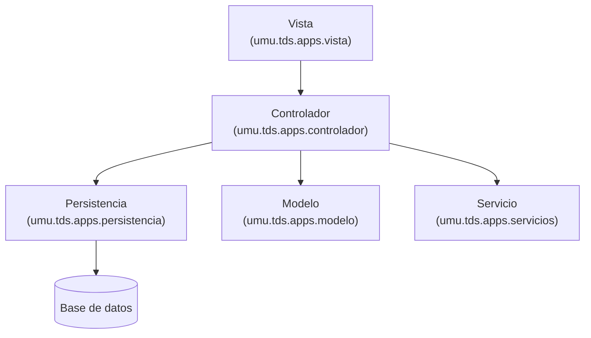

# Arquitectura

AppChat sigue una **arquitectura en capas** basada en el principio de separación Modelo-Vista, aplicando el patrón arquitectónico Modelo-Vista-Controlador (MVC).

La Vista recibe las peticiones del usuario y se las comunica al Controlador. Este último delega cada petición a la capa correspondiente: a la **Persistencia** si implica guardar, modificar, eliminar o recuperar entidades de la base de datos; al **Modelo** si implica manejar entidades del modelo en memoria; o a un **Servicio** concreto (por ejemplo, el generador de PDFs).

Este diseño respeta los principios fundamentales del MVC: separación de responsabilidades, bajo acoplamiento entre capas, y flujo de datos unidireccional (la Vista nunca accede directamente al Modelo).

## Estructura de paquetes

| Paquete | Responsabilidad |
|---|---|
| [`umu.tds.apps.app`](../src/main/java/umu/tds/apps/app) | Punto de entrada ([`AppChat`](../src/main/java/umu/tds/apps/app/AppChat.java)) y carga de datos de ejemplo ([`DataLoader`](../src/main/java/umu/tds/apps/app/DataLoader.java)) |
| [`umu.tds.apps.controlador`](../src/main/java/umu/tds/apps/controlador) | El [`Controlador`](../src/main/java/umu/tds/apps/controlador/Controlador.java), único punto de coordinación de la lógica de aplicación |
| [`umu.tds.apps.modelo`](../src/main/java/umu/tds/apps/modelo) | Entidades del modelo: [`Usuario`](../src/main/java/umu/tds/apps/modelo/Usuario.java), [`Contacto`](../src/main/java/umu/tds/apps/modelo/Contacto.java), [`ContactoIndividual`](../src/main/java/umu/tds/apps/modelo/ContactoIndividual.java), [`Grupo`](../src/main/java/umu/tds/apps/modelo/Grupo.java), [`Mensaje`](../src/main/java/umu/tds/apps/modelo/Mensaje.java) |
| [`umu.tds.apps.modelo.descuentos`](../src/main/java/umu/tds/apps/modelo/descuentos) | Políticas de descuento sobre la suscripción Premium |
| [`umu.tds.apps.persistencia`](../src/main/java/umu/tds/apps/persistencia) | Interfaces DAO |
| [`umu.tds.apps.persistencia.tdsimpl`](../src/main/java/umu/tds/apps/persistencia/tdsimpl) | Implementación de los DAO usando el servicio de persistencia de TDS |
| [`umu.tds.apps.repositorios`](../src/main/java/umu/tds/apps/repositorios) | [`RepositorioUsuarios`](../src/main/java/umu/tds/apps/repositorios/RepositorioUsuarios.java), caché en memoria de usuarios cargados |
| [`umu.tds.apps.servicios`](../src/main/java/umu/tds/apps/servicios) | Servicios externos a los que delega el Controlador (p. ej. [`ExportPDF`](../src/main/java/umu/tds/apps/servicios/ExportPDF.java)) |
| [`umu.tds.apps.servicios.descargas`](../src/main/java/umu/tds/apps/servicios/descargas) | Obtención de la ruta de descargas según el sistema operativo |
| [`umu.tds.apps.servicios.filtros`](../src/main/java/umu/tds/apps/servicios/filtros) | Lógica de filtrado de mensajes (búsqueda) |
| [`umu.tds.apps.utils`](../src/main/java/umu/tds/apps/utils) | Constantes y utilidades comunes |
| [`umu.tds.apps.vista`](../src/main/java/umu/tds/apps/vista) | Ventanas Swing (frontend) |