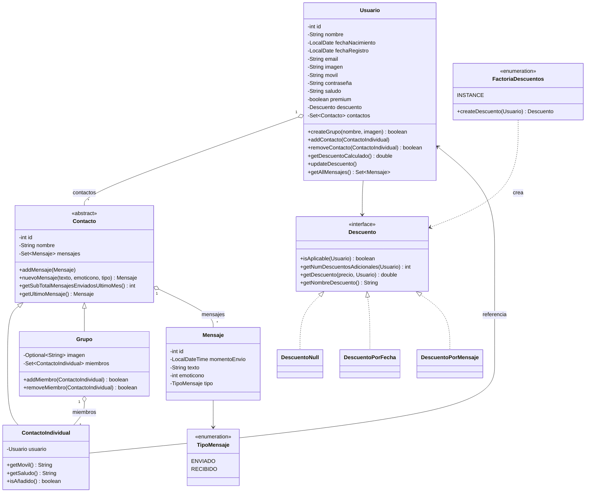

# Diagrama de clases (dominio)

Generado a partir del código fuente en `umu.tds.apps.dominio`, no del boceto original de la memoria, para que refleje fielmente el modelo final.

## Notas sobre el modelo

- `Contacto` es abstracta y raíz común de `ContactoIndividual` y `Grupo` — permite que `Usuario` guarde ambos en la misma colección (`Set<Contacto>`).
- Un `ContactoIndividual` referencia al `Usuario` real de AppChat al que representa (así se obtiene su móvil o saludo actualizados).
- `Grupo` mantiene su propia colección de `ContactoIndividual` como miembros, independiente de los contactos del usuario que creó el grupo.
- El descuento de un `Usuario` se calcula mediante `FactoriaDescuentos` (patrón Strategy + Factory), ver [patrones-diseno.md](patrones-diseno.md).