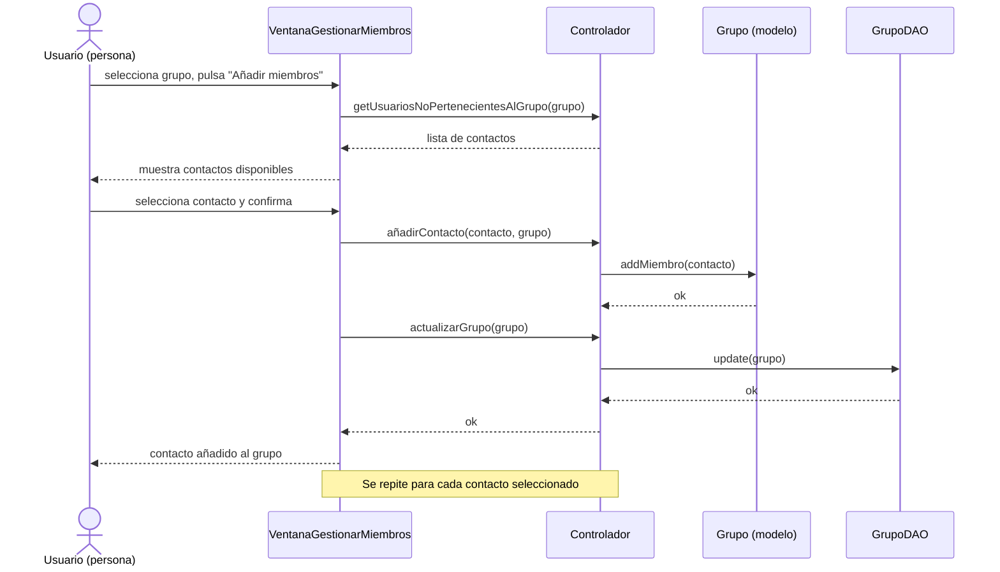

# Diagrama de secuencia: añadir contacto a un grupo

Ejemplifica el patrón MVC seguido en AppChat: la Vista (`VentanaGestionarMiembros`) nunca accede directamente al Modelo, todas las peticiones pasan por el Controlador (Fachada), que coordina el Modelo (`Grupo`) y la Persistencia (`GrupoDAO`).

