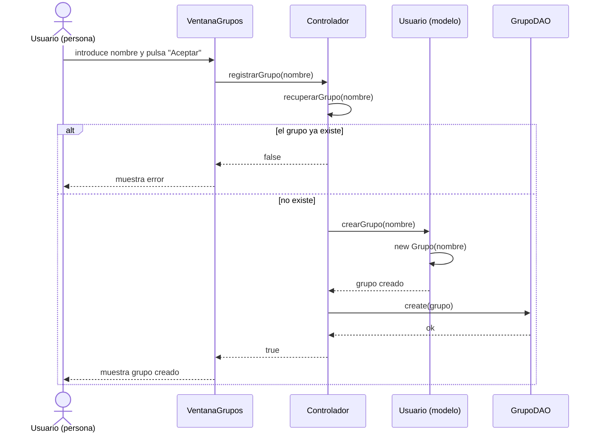

# Diagrama de secuencia: crear grupo

Ejemplifica el patrón MVC seguido en AppChat: la Vista (`VentanaGrupos`) nunca accede directamente al Modelo, todas las peticiones pasan por el Controlador (Fachada), que coordina el Modelo (`Usuario`, `Grupo`) y la Persistencia (`GrupoDAO`).

