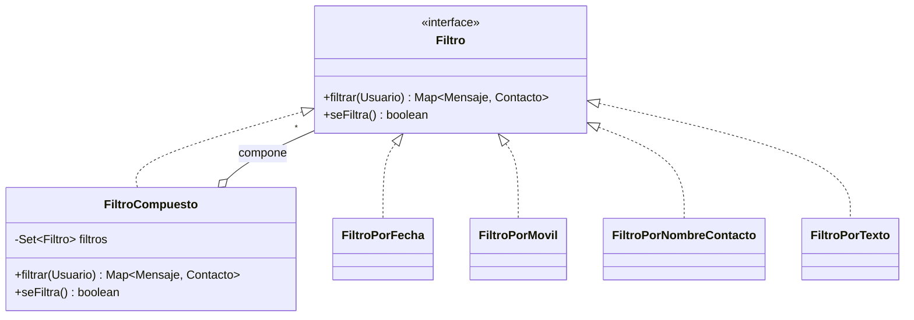

# Patrones de diseño utilizados

## Usados directamente

### Composite — filtros de mensajes
[`FiltroCompuesto`](../src/main/java/umu/tds/apps/servicios/filtros/FiltroCompuesto.java) acumula dinámicamente varios filtros base ([`FiltroPorFecha`](../src/main/java/umu/tds/apps/servicios/filtros/FiltroPorFecha.java), [`FiltroPorMovil`](../src/main/java/umu/tds/apps/servicios/filtros/FiltroPorMovil.java), [`FiltroPorNombreContacto`](../src/main/java/umu/tds/apps/servicios/filtros/FiltroPorNombreContacto.java), [`FiltroPorTexto`](../src/main/java/umu/tds/apps/servicios/filtros/FiltroPorTexto.java)) y los aplica todos a la vez, tratando el compuesto igual que a cualquier filtro individual.

### Strategy — política de descuentos
Familia de algoritmos de descuento ([`DescuentoPorFecha`](../src/main/java/umu/tds/apps/modelo/descuentos/DescuentoPorFecha.java), [`DescuentoPorMensaje`](../src/main/java/umu/tds/apps/modelo/descuentos/DescuentoPorMensaje.java), [`DescuentoNull`](../src/main/java/umu/tds/apps/modelo/descuentos/DescuentoNull.java)) intercambiables tras la interfaz [`Descuento`](../src/main/java/umu/tds/apps/modelo/descuentos/Descuento.java). En función de las condiciones del [`Usuario`](../src/main/java/umu/tds/apps/modelo/Usuario.java), se elige una única política. Acompañado de una Factoría ([`FactoriaDescuentos`](../src/main/java/umu/tds/apps/modelo/descuentos/FactoriaDescuentos.java), enum-singleton) que recorre las estrategias disponibles y devuelve la primera aplicable, o `DescuentoNull` si ninguna lo es. Ver [diagrama-clases.md](diagrama-clases.md).

### Factory Method — ruta de descargas por sistema operativo
El servicio de exportación a PDF necesita la carpeta de Descargas del sistema, que difiere según el SO. [`FactoriaProveedorRutaDescargas`](../src/main/java/umu/tds/apps/servicios/descargas/FactoriaProveedorRutaDescargas.java) (enum-singleton) delega en el [`ProveedorRutaDescargas`](../src/main/java/umu/tds/apps/servicios/descargas/ProveedorRutaDescargas.java) (Linux/Windows/Mac) compatible con el entorno de ejecución.

### Facade — el Controlador
Dada la arquitectura en capas, el [`Controlador`](../src/main/java/umu/tds/apps/controlador/Controlador.java) actúa como intermediario único entre la Vista y el Modelo: la Vista solo conoce al Controlador, nunca a las entidades del modelo directamente.

### Singleton
Se garantiza una única instancia de: el `Controlador` (coordina toda la lógica de aplicación), el servicio de generación de PDFs, y cada adaptador DAO.

## Usados indirectamente

- **Composite** — en la creación de menús con `JMenu`/`JMenuItem` de Swing.
- **DAO** — Factoría Abstracta ([`TDSFactoriaDAO`](../src/main/java/umu/tds/apps/persistencia/tdsimpl/TDSFactoriaDAO.java) crea familias de DAOs) y Adapter (cada `EntidadDAO` adapta el servicio de persistencia de TDS a la interfaz esperada por la aplicación).
- **Observer** — registro de listeners (`ActionListener`) en los componentes de la Vista para escuchar eventos de usuario.
- **Factory Method** — uso de fuentes tipográficas con la librería iText, en [`ExportPDF`](../src/main/java/umu/tds/apps/servicios/ExportPDF.java).