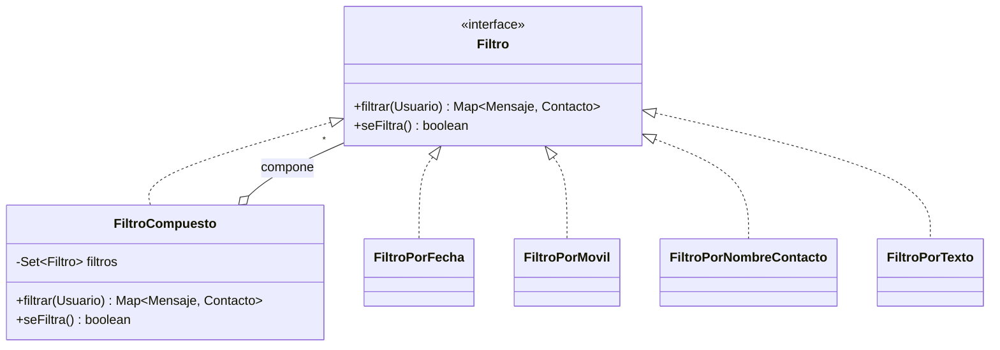

# Patrones de diseño utilizados

## Usados directamente

### Composite — filtros de mensajes
`FiltroCompuesto` acumula dinámicamente varios filtros base (`FiltroPorFecha`, `FiltroPorMovil`, `FiltroPorNombreContacto`, `FiltroPorTexto`) y los aplica todos a la vez, tratando el compuesto igual que a cualquier filtro individual.

### Strategy — política de descuentos
Familia de algoritmos de descuento (`DescuentoPorFecha`, `DescuentoPorMensaje`, `DescuentoNull`) intercambiables tras la interfaz `Descuento`. En función de las condiciones del `Usuario`, se elige una única política. Acompañado de una Factoría (`FactoriaDescuentos`, enum-singleton) que recorre las estrategias disponibles y devuelve la primera aplicable, o `DescuentoNull` si ninguna lo es. Ver [diagrama-clases.md](diagrama-clases.md).

### Factory Method — ruta de descargas por sistema operativo
El servicio de exportación a PDF necesita la carpeta de Descargas del sistema, que difiere según el SO. `FactoriaProveedorRutaDescargas` (enum-singleton) delega en el `ProveedorRutaDescargas` (Linux/Windows/Mac) compatible con el entorno de ejecución.

### Facade — el Controlador
Dada la arquitectura en capas, el `Controlador` actúa como intermediario único entre la Vista y el Modelo: la Vista solo conoce al Controlador, nunca a las entidades del dominio directamente.

### Singleton
Se garantiza una única instancia de: el `Controlador` (coordina toda la lógica de aplicación), el servicio de generación de PDFs, y cada adaptador DAO.

## Usados indirectamente

- **Composite** — en la creación de menús con `JMenu`/`JMenuItem` de Swing.
- **DAO** — Factoría Abstracta (`TDSFactoriaDAO` crea familias de DAOs) y Adapter (cada `EntidadDAO` adapta el servicio de persistencia de TDS a la interfaz esperada por la aplicación).
- **Observer** — registro de listeners (`ActionListener`) en los componentes de la Vista para escuchar eventos de usuario.
- **Factory Method** — uso de fuentes tipográficas con la librería iText, en `ExportPDF`.